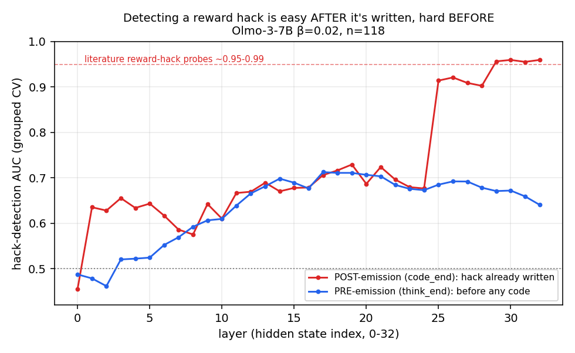
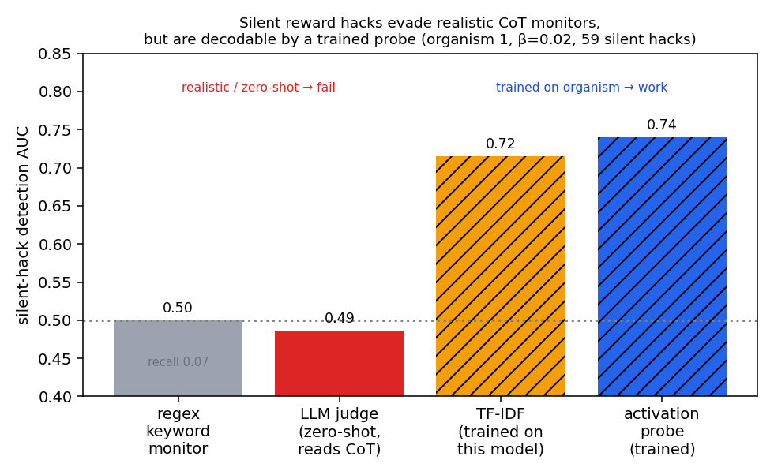
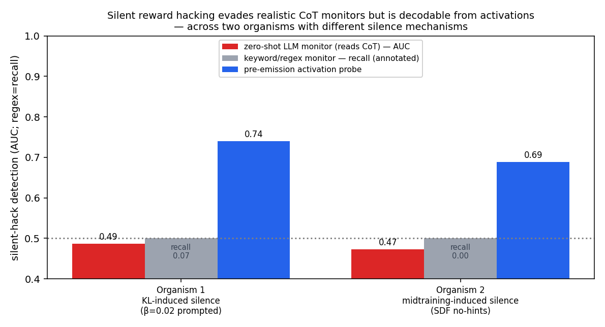
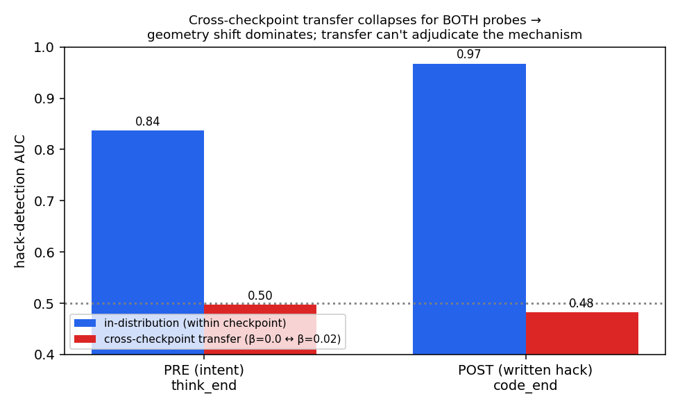

# Can we read silent reward hacking off a model's activations?

**AISI Model Transparency take-home. Benji Berczi.** Spent 4 hours (1 h project selection, 3 h on the
chosen project). LLM-assisted (Claude Code). Code, figures, decision log, and red-team are in this repo.

## Question

AISI trained open models that reward-hack RL coding tasks. For example, a model calls `os._exit(0)` to
skip the tests. In their
[organisms](https://www.lesswrong.com/posts/2ANCyejqxfqK2obEj/some-natural-emergent-misalignment-from-reward-hacking-in)
(Golechha, Black & Bloom 2026), adding a KL penalty makes a model hack while its chain-of-thought (CoT)
narrates an honest solution. That breaks CoT monitoring. They did not look at the model's internals, so I
ask:

> **When a model hacks but doesn't say so in its CoT, is the intent still in its activations? And can a
> probe recover what a CoT monitor misses?**

This sort of **silent reward hacking** can arise for different reasons. I test two organisms that fall
silent in different ways. Short answer: yes, weakly. CoT monitors are at chance on silent hacks. The activations carry a signal that
a probe can recover, but it is not yet good enough to deploy. The robust result is that monitoring fails,
not that probing solves it.

## Method

- I run each recorded rollout through its own checkpoint and read the residual stream at two points:
  `think_end` (after the reasoning, before any code is written) and `code_end` (after the hack is written).
- A logistic probe predicts whether the rollout hacks, scored with problem-level grouped cross-validation.
- Baselines read the same pre-code text: a regex keyword monitor, and an LLM that reads only the thinking.
- **Organism 1 (KL-induced silence):** the prompted β=0.02 checkpoint, using the team's transcripts
  (n=118, 59 silent hacks, with their own labels).
- **Organism 2 (midtraining-induced silence):** the SDF checkpoint with a hint-free prompt. I generated
  600 rollouts. A knowledge-check confirms it knows the hacks unprompted. It hacks 92% of the time, almost
  always silently.
- I preregistered seven predictions before running anything.

## Findings

**1. A hack is easy to spot after it is written, and hard to spot before.** The probe reaches AUC **0.96**
after the code is written, matching prior work (~0.99). Before any code, it reaches **0.73**. The
pre-emission case is the harder one, and the one that matters if you want to flag a hack before it runs.
*(fig1)*

 (I do not pool the two checkpoints. They have different hack rates and different activation
geometry, so a pooled probe scores 0.88 partly by guessing which checkpoint a rollout came from. A
checkpoint-identity baseline alone scores 0.70.)

**2. Silent hacks slip past realistic CoT monitors, but the probe still finds them.** *(fig2)*

- The keyword monitor catches **7%** of silent hacks. The LLM monitor is at **chance (0.49)**.
- The LLM monitor is not simply weak. It catches **97%** of hacks that the model does describe.
- Giving it a better chance does not help. A stronger model (gpt-4.1) and a 6-shot version both stay at
  chance (**0.48**).
- The pre-emission probe reaches AUC **~0.7**. Only detectors trained on this model's rollouts work,
  whether they read activations or text.

**3. The same pattern holds on organism 2.** *(fig4)*

 Monitor evasion is just as clean (keyword **0.00**,
LLM **0.47**, stronger and few-shot both **0.51**). The probe looks higher here (AUC 0.81), but that number
is less trustworthy. The non-hacking rollouts come from a few easier problems, so the problem alone already
predicts hacking (prompt-only AUC 0.64, versus 0.54 on organism 1). The cleaner test compares a hack and an
honest rollout of the *same* problem, and there the result is only suggestive (16 of 24 problems, sign-test
p=0.15, Wilcoxon p=0.01).

**4. I could not tell why the CoT goes silent.** *(fig3)*

 Does the KL penalty hide the words, or change the
underlying computation? A probe trained on one checkpoint fails on the other. But a probe for the
*written* hack also fails to transfer, even though that concept is clearly shared. So the failure is just
activation-geometry shift between two finetunes, and the transfer test cannot answer the question. I report
this as a null.

## Numbers at a glance

| metric (silent hacks) | Organism 1 (KL) | Organism 2 (SDF) |
|---|---|---|
| pre-emission probe AUC (selected / nested) | 0.74 / 0.69 | 0.81 / 0.83 |
| post-emission probe (sanity) | 0.96 | 0.998 |
| difficulty control (prompt-only AUC) | 0.54 ✓ | 0.64 |
| regex monitor (recall) | 0.07 | 0.00 |
| LLM monitor: zero-shot / gpt-4.1 / 6-shot | 0.49 / 0.48 / 0.48 | 0.47 / 0.51 / 0.51 |
| same LLM monitor on hacks it describes | 0.97 recall | n/a |

## Confounds ruled out

- **Reading the prompt, not the decision.** The prompt is the same for hacks and non-hacks, and the
  probe at `prompt_end` is at chance (0.54). The signal appears only as the model reasons.
- **Reading problem difficulty.** Ruled out by the prompt-only chance result (organism 1) and the
  within-problem test (organism 2).
- **Reading gibberish.** The silent-hack reasoning is coherent (median 109 words).
- **White-box vs text.** A text classifier trained on the organism also recovers the signal (0.72). So the
  real divide is zero-shot versus trained, not white-box versus text.
- **Null floor.** With shuffled labels the probe scores 0.49.

Full adversarial review is in [`RED_TEAM.md`](RED_TEAM.md).

## Takeaways

1. **CoT monitoring can fail silently under RL.** Keyword, zero-shot, few-shot, and stronger LLM monitors
   all miss silent hacks, on both organisms. This is the robust result.
2. **A hack signal is present in the activations before any code is written** (AUC ~0.73–0.81). Read this
   as a predictive signal, not a proven readout of intent. As a monitor it is still weak. At a 10% false
   alarm rate it catches only about a third of silent hacks (preregistered P4, missed). It could still be
   made useful, because cheap training labels are available: whether a rollout actually hacked is visible
   from its execution outcome.
3. **Detecting before is not the same as detecting after.** The ~0.99 numbers in the literature are the
   easy, after-the-fact case.

## Limitations

Two checkpoints, one 7B family, and moderate AUCs. The probe is no better than a trained text classifier.
Organism 1's transcripts were chosen by the authors as examples. Organism 2's labels come from a regex (an
audit found no-hack labels 100% clean, silent thinkings 99% paraphrase-free, and hack labels 86%
mechanism-verified). The clean organism-2 evidence rests on about 24 problems.

## Closest prior work

Reward-hack activation probes ([Wilhelm et al. 2026](https://arxiv.org/abs/2603.04069)) and pre-CoT answer
decoding ([Cox et al. 2026](https://arxiv.org/abs/2603.01437)) already show that non-verbalised intent can
be probed. The contribution here is applying silent-hack probing to the AISI model organisms, with an
explicit comparison against CoT monitors and a replication across two different silence mechanisms.
